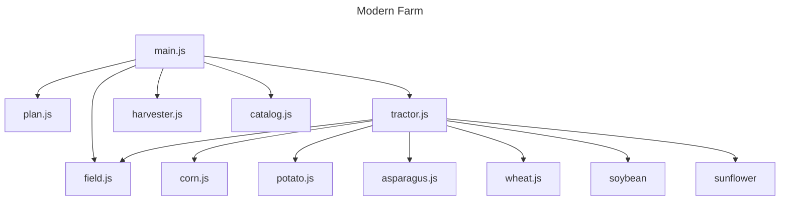

```mermaid
---
title: Modern Farm
---
flowchart TD
    main["main.js"]
    plan["plan.js"]
    field["field.js"]
    tractor["tractor.js"]
    harvester["harvester.js"]
    catalog["catalog.js"]
    corn["corn.js"]
    asparagus["asparagus.js"]
    potato["potato.js"]
    wheat["wheat.js"]
    soybean["soybean"]
    sunflower["sunflower"]
    main-->plan
    main-->field
    main-->tractor
    main-->harvester
    main-->catalog
    tractor-->field
    tractor-->corn
    tractor-->potato
    tractor-->asparagus
    tractor-->wheat
    tractor-->soybean
    tractor-->sunflower
```
