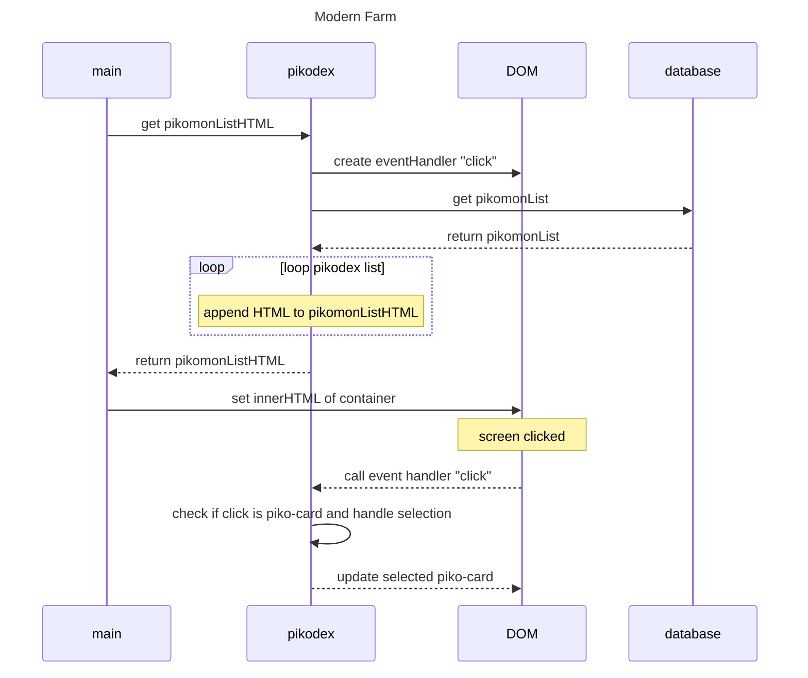

```mermaid
sequenceDiagram

title Modern Farm

main->>pikodex:get pikomonListHTML
pikodex->>DOM:create eventHandler "click"
pikodex->>database: get pikomonList
database-->>pikodex: return pikomonList
loop loop pikodex list
note over pikodex:append HTML to pikomonListHTML
end
pikodex-->>main:return pikomonListHTML
main->>DOM:set innerHTML of container
note over DOM:screen clicked
DOM-->>pikodex:call event handler "click"
pikodex->>pikodex:check if click is piko-card and handle selection
pikodex-->>DOM:update selected piko-card
```
