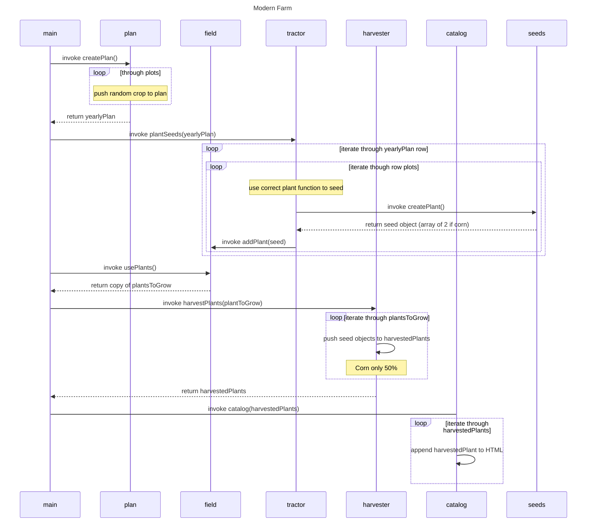

```mermaid
sequenceDiagram

title Modern Farm

participant main
participant plan
participant field
participant tractor
participant harvester
participant catalog

participant seeds

main->>plan:invoke createPlan()
loop through plots
note over plan:push random crop to plan
end
plan-->>main:return yearlyPlan
main->>tractor:invoke plantSeeds(yearlyPlan)
loop iterate through yearlyPlan row
loop iterate though row plots
note over tractor:use correct plant function to seed
tractor->>seeds:invoke createPlant()
seeds-->>tractor:return seed object (array of 2 if corn)
tractor->>field:invoke addPlant(seed)
end
end
main->>field:invoke usePlants()
field-->>main:return copy of plantsToGrow
main->>harvester:invoke harvestPlants(plantToGrow)
loop iterate through plantsToGrow
harvester->>harvester:push seed objects to harvestedPlants
note over harvester:Corn only 50%
end
harvester-->>main:return harvestedPlants
main->catalog:invoke catalog(harvestedPlants)
loop iterate through harvestedPlants
catalog->>catalog:append harvestedPlant to HTML
end
```
